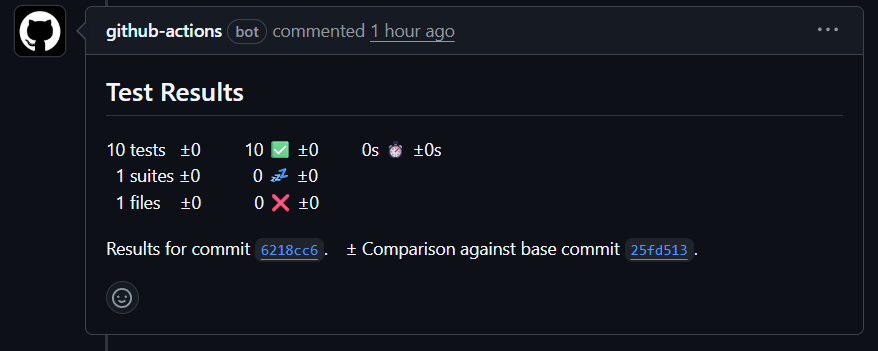
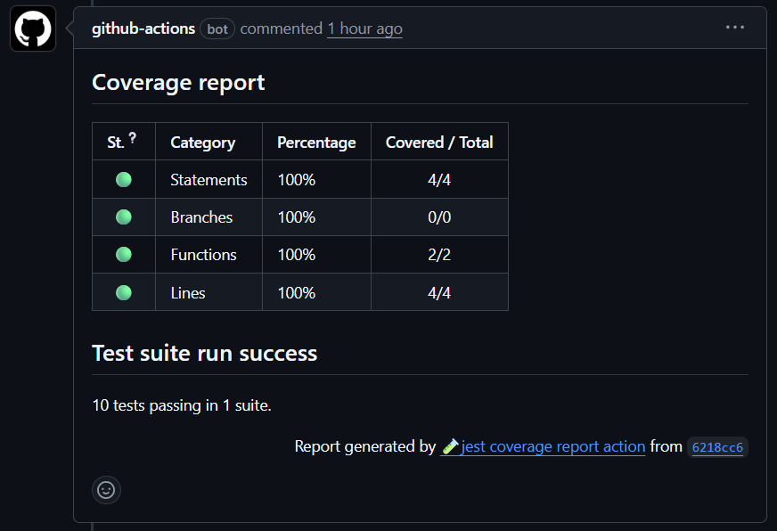

# Actions

This repository contains reusable GitHub Actions workflows for various CI/CD tasks,
such as setting up Node.js environments and building Docker images. These workflows
can be integrated into other repositories to streamline development and
deployment processes. The workflows are designed to be flexible and configurable
to suit different project requirements. To use these workflows, simply reference
them in your repository's GitHub Actions configuration.

These actions will evolve over time, so make sure to check back for updates and improvements.
To use the latest version of these workflows, reference the `main` branch
of this repository in the `uses` field of your workflow job definition, like so:

```yaml
jobs:
  example-job:
    uses: infitx-org/actions/.github/workflows/<name>.yaml@main
```

As the main branch may change over time, it's recommended to pin to a specific
version for production use. For this, you can reference a specific tag
or commit SHA instead of the `main` branch, for example:

```yaml
jobs:
  example-job:
    uses: infitx-org/actions/.github/workflows/<name>.yaml@v1.0.0
```

## Node.js CI Workflow

This workflow sets up a Node.js environment for continuous integration (CI)
tasks. It can be reused across multiple repositories to ensure consistent
testing and building of Node.js applications. To use this workflow in your
repository, add the following file `./.github/workflows/node.yaml`:

```yaml
name: Node.js

on:
  push:
    branches: [ "main" ]
  pull_request:
    branches: [ "main" ]

jobs:
  node:
    uses: infitx-org/actions/.github/workflows/node.yaml@main
    with:
      node-version: '22.x'
```

### Integration points

This workflow looks for the following scripts in the `./package.json` file and runs
the appropriate jobs, if the script is found. All the scripts are optional.

- `ci-lint`: This should run code linting.

  Example:

  ```json
  {
    "scripts": {
        "lint": "eslint .",
        "ci-lint": "npm run lint",
    }
  }
  ```

- `ci-unit`: This should run the unit tests in CI mode. If it outputs a file named
  `./coverage/junit.xml`, the test results will be published in the PR.

  Example:

  ```json
  {
    "scripts": {
      "ci-unit": "JEST_JUNIT_OUTPUT_DIR=coverage npm run test:unit -- --ci --reporters=default --reporters=jest-junit --outputFile=./coverage/junit.xml"
    }
  }
  ```

  

- `ci-coverage`: This should run the test coverage in CI mode. If it outputs a
  file named `coverage/report.json`, a coverage report summary will be published
  in the PR.

  Example:

  ```json
  {
    "scripts": {
      "test:unit": "jest",
      "ci-unit": "npm run test:unit -- --silent --ci --coverage --testLocationInResults --json --outputFile=coverage/report.json"
    }
  }
  ```

  

- `ci-audit`: This should run a vulnerability check for the dependencies. If it
  outputs a file named `./audit/auditResults.json`, it will be included as
  a build artifact.

  Example:

  ```json
  {
    "scripts": {
      "audit:check": "audit-ci --config ./audit-ci.jsonc",
      "ci-audit": "mkdir -p audit; npm run audit:check -- --report-type summary; npm run --silent audit:check -- -o json > ./audit/auditResults.json",
    }
  }
  ```

- `ci-deprecation`: This should run a deprecation check for the dependencies.

  Example:

  ```json
  {
    "scripts": {
      "ci-deprecation": "MODE=error check-deprecations-npm"
    },
    "devDependencies": {
      "@mojaloop/ml-depcheck-utility": "^1.1.3",
    }
  }
  ```

## Docker Workflow

This workflow builds and pushes Docker images to a container registry.
It can be reused across multiple repositories to ensure consistent Docker
image building and deployment.

To use this workflow in your repository, add the following file `./.github/workflows/docker.yaml`.

This workflow allows building multiple images from a single repository.
Use the `matrix` property to list the Dockerfiles and images, as in the
example below:

```yaml
name: Docker

on:
  push:
    tags: ["v*.*.*"]
  pull_request:
    branches: [ "main" ]

jobs:
  build:
    strategy:
      fail-fast: false
      matrix:
        include:
          - dockerfile: Dockerfile
            image: core-connector-template
            context: .
          - dockerfile: cbs-mock/Dockerfile
            image: cbs-mock-template
            context: ./cbs-mock
    uses: infitx-org/actions/.github/workflows/docker.yaml@main
    with:
      dockerfile: ${{ matrix.dockerfile }}
      image: ${{ matrix.image }}
      context: ${{ matrix.context }}
      owner: ${{ github.repository_owner }}
    secrets:
      REGISTRY_PASSWORD: ${{ secrets.GITHUB_TOKEN }}
```

### Pushing to Different Registries

By default, the workflow will build and push images to the GitHub Container Registry.
To push to Docker Hub or another registry, pass the `registry`, `owner` and
`REGISTRY_PASSWORD` like this:

```yaml
jobs:
  build:
    uses: infitx-org/actions/.github/workflows/docker.yaml@main
    with:
      registry: docker.io
      owner: example-owner
    secrets:
      REGISTRY_PASSWORD: ${{ secrets.DOCKERHUB_PASSWORD }}
```

### Triggering downstream workflows

To trigger downstream workflows after a successful Docker image build and push,
set the `downstream` and `TRIGGER_DOWNSTREAM` secret like this:

```yaml
jobs:
  build:
    uses: infitx-org/actions/.github/workflows/docker.yaml@main
    with:
      downstream: https://api.github.com/repos/<owner>/<repo>/actions/workflows/<workflow_name>.yaml/dispatches
    secrets:
      TRIGGER_DOWNSTREAM: ${{ secrets.TRIGGER_TOKEN }}
```

## Release Please Workflow

This workflow automates the release process using the
[Release Please tool](https://github.com/googleapis/release-please).

This tool does the following:

- Analyzes merged pull requests to determine the next semantic version bump
  (major, minor, patch) based on conventional commit messages.
- Updates the version in relevant files (e.g., `package.json`, `CHANGELOG.md`).
- Creates a new release pull request with the updated version and changelog.
  When the release PR is merged, it automatically creates a new GitHub release,
  which can trigger the Docker workflow to build and push new images.

Check the [Release Please documentation](https://github.com/googleapis/release-please)
for more details.

It can be reused across multiple repositories to ensure consistent versioning
and changelog generation. To use this workflow in your repository, add the
following file `./.github/workflows/release.yml`:

```yaml
name: Release
on:
  push:
    branches:
      - main

permissions:
  contents: write
  issues: write
  pull-requests: write

jobs:
  release:
    uses: infitx-org/actions/.github/workflows/release.yaml@main
    secrets:
      token: ${{ secrets.GITHUB_TOKEN }}
```
