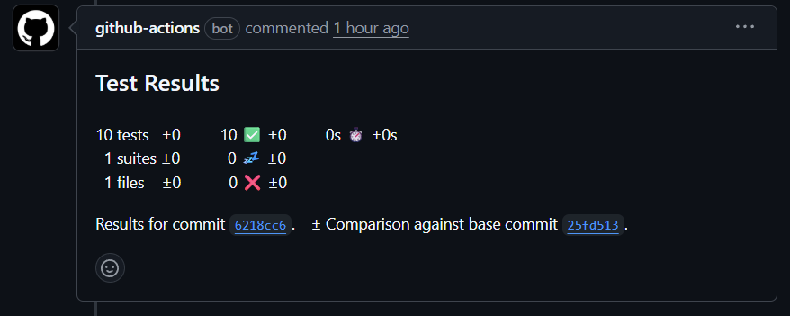
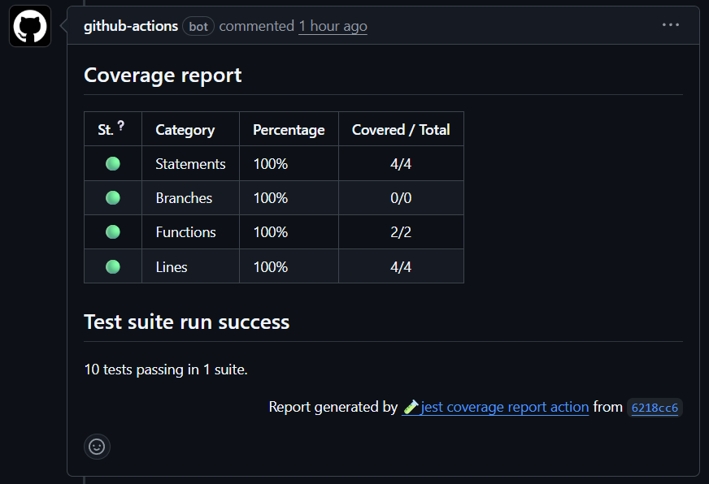
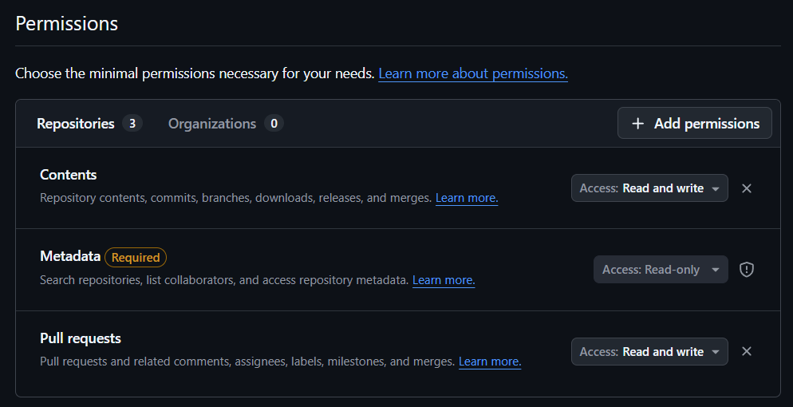
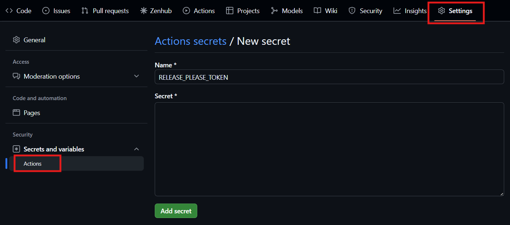

# Actions

This repository contains reusable GitHub Actions workflows for various CI/CD tasks,
such as setting up Node.js environments and building Docker images. These workflows
can be integrated into other repositories to streamline development and
deployment processes. The workflows are designed to be flexible and configurable
to suit different project requirements. To use these workflows, simply reference
them in your repository's GitHub Actions configuration.

These actions will evolve over time, so make sure to check back for updates and improvements.
To use the latest version of these workflows, reference the `main` branch
of this repository in the `uses` field of your workflow job definition, like so:

```yaml
jobs:
  example-job:
    uses: infitx-org/actions/.github/workflows/<name>.yaml@main
```

As the main branch may change over time, it's recommended to pin to a specific
version for production use. For this, you can reference a specific tag
or commit SHA instead of the `main` branch, for example:

```yaml
jobs:
  example-job:
    uses: infitx-org/actions/.github/workflows/<name>.yaml@v1.0.0
```

## Rush monorepo CI workflow

`rush.yaml` is the reporting-focused CI workflow for Rush monorepos (blong and its
derivatives). It runs `rush ci-test`, then delegates the whole report to a
**repo-owned hook**:

```yaml
jobs:
  build:
    permissions:
      contents: write # commit-metrics pushes the baseline to the PR branch
      pull-requests: write
    uses: infitx-org/actions/.github/workflows/rush.yaml@main
    with:
      ci-test-jobs: 2
    secrets:
      REPORT_TOKEN: ${{ secrets.REPORT_TOKEN }}
```

| Input                | Purpose                                                                     |
| -------------------- | --------------------------------------------------------------------------- |
| `ci-test-jobs`       | Rush `--parallelism` for the test step.                                     |
| `ci-test-verbose`    | `true` streams every project's output; the default buffers and shows only failures. |
| `reports-repository` | Repository hosting the published reports (`<repo>-ci` by default).           |
| `node-version`       | Node version used by every job.                                             |

Secrets: `REPORT_TOKEN` (write access to the reports repository),
`CHROMATIC_PROJECT_TOKEN`, `BLONG_MASTER_KEY`.

### The `.ci-report/` contract

Every package that runs tests writes `<pkg>/.ci-report/`: `report.json`
(machine readable: package, runner, counts, suites, per-test status, message,
stack, file, line, trace) plus `summary.md` for humans. Each runner does this
itself — `blong-dev test` for tap, `blong-dev playwright` for Playwright,
`blong-dev report vitest` for vitest.

The workflow then runs the repository's `ci-report` script
(`rush ci-report`, skipped silently when no package implements it), which:

1. aggregates every `.ci-report/` into `report-data/ci-summary.json`,
2. renders `ci-report.md` — the action run summary and the sticky PR comment,
   with a per-package table, deltas against the base branch, and a **Failed
   suites** section listing each failing test,
3. writes the `metrics` snapshot artifact,
4. rebuilds `.github/metrics.json` and `.github/history.jsonl` as *base branch +
   this run* (never appending to whatever the branch already holds, so repeated
   runs of one pull request cannot accumulate data),
5. builds the failures bundle for a red run: `ci-failures/publish/` with
   `index.html` (single-file Allure report of the failing tests only, from real
   Playwright results plus synthesised ones for tap/vitest), `failures.json` (the
   machine readable index an agent can read instead of the logs), `failures.md`
   and `traces/`.

`commit-metrics` then commits the two baseline files onto the pull request head
branch, so merging the PR carries them to the base branch and no separate
post-merge commit is needed. Add this to the caller so the metrics commit does not
start another run (the action also carries the guard):

```yaml
on:
  pull_request:
    branches: [main]
    paths-ignore:
      - .github/metrics.json
      - .github/history.jsonl
```

### Published reports

Per-package payloads (`<pkg>/.ci-report/publish`) and the failures bundle are
published to the `gh-pages` branch of the reports repository by `deploy-report`,
under `docs/<tool>/<workflow>/<run-number>/`. The failures bundle additionally
answers on a stable alias:

- `https://<owner>.github.io/<reports-repo>/failures/<workflow>/<run>/failures.json`
- `https://<owner>.github.io/<reports-repo>/failures/<workflow>/latest/failures.json`

The alias is removed again on the next green run, so a URL handed to an agent
never points at a stale report.

### Action run duration

The report is deliberately generated from JSON rather than from runner output:
tap runs with its `json` reporter saved to `.ci-report/tap.json`, so the CI log
only shows failing tests plus a summary line instead of every passing assertion
and every diagnostics dump.

## Node.js CI Workflow

This workflow sets up a Node.js environment for continuous integration (CI)
tasks. It can be reused across multiple repositories to ensure consistent
testing and building of Node.js applications. To use this workflow in your
repository, add the following file `./.github/workflows/node.yaml`:

```yaml
name: Node.js

on:
  push:
    branches: [ "main" ]
  pull_request:
    branches: [ "main" ]

permissions:
  contents: read
  issues: read
  checks: write
  pull-requests: write

jobs:
  node:
    uses: infitx-org/actions/.github/workflows/node.yaml@main
    with:
      node-version: '22.x'
```

### Integration points

This workflow looks for the following scripts in the `./package.json` file and runs
the appropriate jobs, if the script is found. All the scripts are optional.

- `ci-lint`: This should run code linting.

  Example:

  ```json
  {
    "scripts": {
        "lint": "eslint .",
        "ci-lint": "npm run lint",
    }
  }
  ```

- `ci-unit`: This should run the unit tests in CI mode. If it outputs a file named
  `./coverage/junit.xml`, the test results will be published in the PR.

  Example:

  ```json
  {
    "scripts": {
      "ci-unit": "JEST_JUNIT_OUTPUT_DIR=coverage npm run test:unit -- --ci --reporters=default --reporters=jest-junit --outputFile=./coverage/junit.xml"
    }
  }
  ```

  

- `ci-coverage`: This should run the test coverage in CI mode. If it outputs a
  file named `coverage/report.json`, a coverage report summary will be published
  in the PR.

  Example:

  ```json
  {
    "scripts": {
      "test:unit": "jest",
      "ci-unit": "npm run test:unit -- --silent --ci --coverage --testLocationInResults --json --outputFile=coverage/report.json"
    }
  }
  ```

  

- `ci-audit`: This should run a vulnerability check for the dependencies. If it
  outputs a file named `./audit/auditResults.json`, it will be included as
  a build artifact.

  Example:

  ```json
  {
    "scripts": {
      "audit:check": "audit-ci --config ./audit-ci.jsonc",
      "ci-audit": "mkdir -p audit; npm run audit:check -- --report-type summary; npm run --silent audit:check -- -o json > ./audit/auditResults.json",
    }
  }
  ```

- `ci-deprecation`: This should run a deprecation check for the dependencies.

  Example:

  ```json
  {
    "scripts": {
      "ci-deprecation": "MODE=error check-deprecations-npm"
    },
    "devDependencies": {
      "@mojaloop/ml-depcheck-utility": "^1.1.3",
    }
  }
  ```

## Docker Workflow

This workflow builds and pushes Docker images to a container registry.
It can be reused across multiple repositories to ensure consistent Docker
image building and deployment.

To use this workflow in your repository, add the following file `./.github/workflows/docker.yaml`.

This workflow allows building multiple images from a single repository.
Use the `matrix` property to list the Dockerfiles and images, as in the
example below:

```yaml
name: Docker

on:
  push:
    tags: ["v*.*.*"]
  pull_request:
    branches: [ "main" ]

jobs:
  build:
    strategy:
      fail-fast: false
      matrix:
        include:
          - dockerfile: Dockerfile
            image: core-connector-template
            context: .
          - dockerfile: cbs-mock/Dockerfile
            image: cbs-mock-template
            context: ./cbs-mock
    uses: infitx-org/actions/.github/workflows/docker.yaml@main
    with:
      dockerfile: ${{ matrix.dockerfile }}
      image: ${{ matrix.image }}
      context: ${{ matrix.context }}
      owner: ${{ github.repository_owner }}
    secrets:
      REGISTRY_PASSWORD: ${{ secrets.GITHUB_TOKEN }}
```

### Pushing to Different Registries

By default, the workflow will build and push images to the GitHub Container Registry.
To push to Docker Hub or another registry, pass the `registry`, `owner` and
`REGISTRY_PASSWORD` like this:

```yaml
jobs:
  build:
    uses: infitx-org/actions/.github/workflows/docker.yaml@main
    with:
      registry: docker.io
      owner: example-owner
    secrets:
      REGISTRY_PASSWORD: ${{ secrets.DOCKERHUB_PASSWORD }}
```

### Triggering downstream workflows

To trigger downstream workflows after a successful Docker image build and push,
set the `downstream` and `TRIGGER_DOWNSTREAM` secret like this:

```yaml
jobs:
  build:
    uses: infitx-org/actions/.github/workflows/docker.yaml@main
    with:
      downstream: https://api.github.com/repos/<owner>/<repo>/actions/workflows/<workflow_name>.yaml/dispatches
    secrets:
      TRIGGER_DOWNSTREAM: ${{ secrets.TRIGGER_TOKEN }}
```

## Release

This workflow automates the release process using the
[Release Please tool](https://github.com/googleapis/release-please).

This tool does the following:

- Analyzes merged pull requests to determine the next semantic version bump
  (major, minor, patch) based on conventional commit messages.
- Updates the version in relevant files (e.g., `package.json`, `CHANGELOG.md`).
- Creates a new release pull request with the updated version and changelog.
  When the release PR is merged, it automatically creates a new GitHub release,
  which can trigger the Docker workflow to build and push new images.

Check the [Release Please documentation](https://github.com/googleapis/release-please)
for more details.

It can be reused across multiple repositories to ensure consistent versioning
and changelog generation. To use this workflow in your repository, add the
following file `./.github/workflows/release.yml`:

```yaml
name: Release
on:
  push:
    branches:
      - main

jobs:
  release:
    uses: infitx-org/actions/.github/workflows/release.yaml@main
    secrets:
      token: ${{ secrets.RELEASE_PLEASE_TOKEN }}
```

### Configuring the RELEASE_PLEASE_TOKEN

To allow the Release Please workflow to create release pull requests and
GitHub releases, you need to provide a personal access token (PAT) with the
`repo` scope. Create a new PAT in your GitHub account settings and add it
as a secret named `RELEASE_PLEASE_TOKEN` in your repository settings.

1. Navigate to https://github.com/settings/personal-access-tokens/new
1. Fill the fields as needed and ensure the following permissions are selected:

   - Contents: Read & Write
   - Pull requests: Read & Write
   
1. Click "Generate token" and copy the generated token.
1. Go to your repository on GitHub, navigate to "Settings" > "Secrets and
   variables" > "Actions".
1. Click "New repository secret", name it `RELEASE_PLEASE_TOKEN`, and paste the
   copied token into the "Value" field.

1. Click "Add secret" to save.
